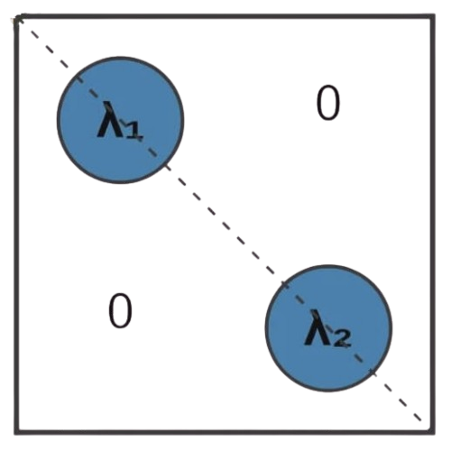

# Automated Matrix Diagonalizer

<div align="center">



A web application that checks if an n×n matrix (n ≤ 5) is diagonalizable. If so, it computes matrices **P** and **D** such that **P⁻¹AP = D**.

</div>

---

## Try It Here
Automated Matrix Diagonalizer: https://automated-matrix-diagonalizer.onrender.com/

---
## Table of Contents

- [Automated Matrix Diagonalizer](#automated-matrix-diagonalizer)

  - [Table of Contents](#table-of-contents)
  
  - [About](#about)
    - [The Power of Diagonalization](#the-power-of-diagonalization) 
  - [Features](#features)
    - [Core Functionality](#core-functionality)
    - [User Experience](#user-experience)
    - [Mathematical Intelligence](#mathematical-intelligence)
  
  - [Demo](#demo)
    - [Diagonalization Example (A = PDP⁻¹)](#diagonalization-example)
  
  - [User Instructions](#user-instructions)
    - [Basic Workflow](#basic-workflow)
  
  - [Operations](#operations)
    - [Diagonalization Process](#diagonalization-process)
      
  - [Technologies Used](#technologies-used)
    - [Frontend Framework](#frontend-framework)
    - [Backend](#backend)
    - [Deployment and Infrastructure](#deployment-and-infrastructure)
      
  - [Project Structure](#project-structure)

 ---

## About

**Automated Matrix Diagonalizer** is a specialized application designed to perform linear algebra computations on square matrices. This program is designed to help students better understand matrix diagonalization through an interactive and easy-to-use interface.

### The Power of Diagonalization
**Fast Computations**
- It makes calculating high powers (like A100) nearly instant. Instead of multiplying the whole matrix 100 times, you simply raise the diagonal elements to that power (D100).

**System Simplification**
- It "decouples" variables in complex systems of equations, allowing you to solve each part independently.
  
**Data Insight**
- It reveals the core "directions" and "strengths" of a transformation, which is essential for things like image compression and search engine algorithms.

---

## Features

### Core Functionality
**Dynamic Matrix Input** 
- Adjustable matrix size from 2x2 up to 5x5.
  
**Automated Diagonalization**
- Computes eigenvalues and eigenvectors to generate matrices P and D automatically.

### User Experience
**Clean UI**
- Centered, responsive design that works on both desktop and mobile browsers.
  
**Instant Reset**
- Features a clear function to quickly reset inputs for new calculations.

### Mathematical Intelligence
**Automated Validation**
- Detects if a matrix is non-diagonalizable and provides explanatory feedback.
  
**Numerical Precision**
- Accurately handles complex calculations involving integers and decimals.


  
**IMPORTANT NOTICE:** This application is hosted on Render’s free tier. If the site has been inactive for more than 15 minutes, it may take approximately 50 seconds to spin up and load the page. Please be patient while the server restarts.


---

## Demo

### Diagonalization Example (A = PDP⁻¹)

```
Input 3x3 Matrix:
[ 2  0  0 ]

[ 1  3  0 ]

[ 0  0  4 ]
```

Output:
Eigenvalues: 2.0, 3.0, 4.0

```
Modal Matrix (P):

[ 1.0  0.0  0.0 ]

[-1.0  1.0  0.0 ]

[ 0.0  0.0  1.0 ]


Diagonal Matrix (D):

[ 2.0  0.0  0.0 ]

[ 0.0  3.0  0.0 ]

[ 0.0  0.0  4.0 ]
```

Validation Example (Non-Diagonalizable)

```
Input 2x2 Matrix: 

[ 1  1 ]

[ 0  1 ]
```

**Output:** Error! The matrix is defective and cannot be diagonalized. 

- Explanation: This matrix has an eigenvalue of 1 with a multiplicity of 2, but it only provides one linearly independent eigenvector. Note: Results are only generated for matrices that satisfy the diagonalization theorem.

---

## User Instructions

### Basic Workflow
1. **Select Matrix Size**
   - Choose your desired dimension (2x2 to 5x5) from the interface.
3. **Data Entry**
   - Enter the numerical values into the matrix input fields for Matrix A.
5. **Submit**
   - Click the “Diagonalize” button to start the computation.
6. **Review Result**
   - If successful, the app displays the Eigenvalues, Matrix P, and Matrix D.
    - If the matrix is not diagonalizable, an explanatory message is shown.

---

## Operations

### Diagonalization Process
 - The user selects a matrix size and inputs values through the web interface.
 - The frontend sends the matrix to the backend for validation and processing.
 - The backend computes eigenvalues and eigenvectors and checks diagonalizability.
 - If possible, matrices P and D are constructed and verified using P⁻¹AP = D.
 - Results are displayed to the user, or an explanatory message is shown if diagonalization is not possible.

---

## Technologies Used

### Frontend Framework
**CSS:** Used for layout, grid styling, and ensuring modern, responsive functions.

**JavaScript:** Manages client-side logic, such as dynamic grip resizing and sending data to the server.

**HTML:** Provides the fundamental structures for the web app and input forms.

### Backend
**Python:** Primary language for server-side processing and mathematical logic.

**Flask:** A lightweight framework used to bridge the interface with the Python logic.

**NumPy:** A high-performance library used to calculate eigenvalues and eigenvectors with high precision.

### Deployment and Infrastructure
**Render:** The cloud platform used for live hosting, ensuring the application is accessible online.

**GitHub:** Used for version control and repository management.

**Procfile:** Configures the server environment for a stable deployment on Render.

---

## Project Structure

- Uses a modular project structure, separating backend logic, frontend templates, and static assets for better organization and maintainability.
- Backend logic is handled in app.py, which manages server operations and matrix diagonalization computations.
- The templates directory contains the HTML file that defines the user interface and displays results.
- The static directory stores CSS and JavaScript files for styling, input handling, and frontend interaction.
- A requirements.txt  file lists all necessary dependencies for easy and consistent setup.

```
linalg/
├── app.py                 # Flask server & diagonalization logic
├── requirements.txt       # Python dependencies
├── templates/
│   └── index.html         # UI template
└── static/
    ├── index.css          # Styling
    └── script.js          # Frontend logic
```


